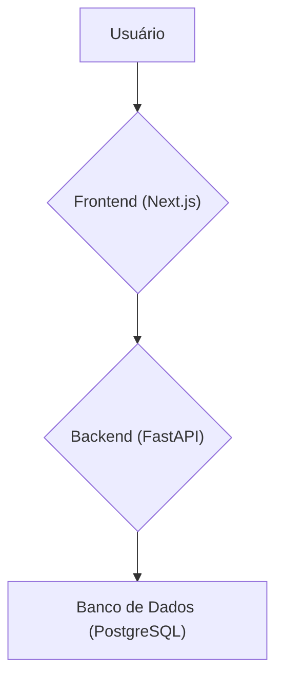
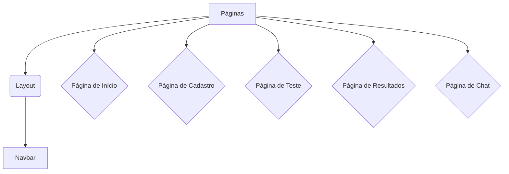

# Perfil MTBI - Teste de Personalidade e Chat com IA


## Tabela de Conteúdos

- [Sobre o Projeto](#sobre-o-projeto)
- [O Teste MBTI e o Processo de Recrutamento](#o-teste-mbti-e-o-processo-de-recrutamento)
- [Arquitetura](#arquitetura)
- [Componentes do Frontend](#componentes-do-frontend)
- [Começando](#começando)
  - [Pré-requisitos](#pré-requisitos)
  - [Instalação](#instalação)
  - [Executando a Aplicação](#executando-a-aplicação)
- [Tecnologias Utilizadas](#tecnologias-utilizadas)
- [Contribuição](#contribuição)
- [Licença](#licença)

## Sobre o Projeto

O Perfil MTBI é uma aplicação web que permite aos usuários realizar um teste de personalidade baseado no modelo Myers-Briggs Type Indicator (MBTI). Após a conclusão do teste, os usuários recebem seu tipo de personalidade e podem interagir com um chatbot de IA para obter mais informações e insights sobre seu perfil.

A aplicação é construída com uma arquitetura de microsserviços, com um backend em Python (FastAPI) e um frontend em Next.js (React) com Tailwind CSS.

## O Teste MBTI e o Processo de Recrutamento

O uso de testes de personalidade como o MBTI no processo de recrutamento e seleção é um tópico amplamente debatido. É crucial entender tanto os benefícios potenciais quanto as críticas e limitações dessa abordagem.

### Benefícios Potenciais

- **Melhor Compreensão do Candidato:** Os testes de personalidade podem fornecer insights sobre as preferências e tendências comportamentais de um candidato, ajudando a entender como ele pode se encaixar na cultura da empresa e em uma equipe específica.
- **Melhora da Dinâmica da Equipe:** Ao entender os diferentes tipos de personalidade dentro de uma equipe, os gestores podem tomar decisões mais informadas sobre como montar equipes equilibradas e produtivas.
- **Ferramenta de Desenvolvimento:** O MBTI pode ser uma ferramenta valiosa para o desenvolvimento pessoal e profissional, ajudando os funcionários a entenderem seus próprios pontos fortes e fracos.

### Críticas e Limitações

- **Validade Científica Questionável:** Muitos psicólogos e pesquisadores questionam a validade e a confiabilidade do MBTI como uma ferramenta científica para prever o desempenho no trabalho.
- **Simplificação Excessiva:** O teste categoriza as pessoas em 16 tipos de personalidade, o que pode ser uma simplificação excessiva da complexidade da personalidade humana.
- **Risco de Discriminação:** O uso indevido de testes de personalidade pode levar à discriminação e à exclusão de candidatos qualificados com base em seus traços de personalidade.

### Nossa Abordagem

Nesta aplicação, o teste MBTI **não é utilizado como uma ferramenta de seleção excludente**, mas sim como um ponto de partida para uma conversa mais profunda e para o autoconhecimento do candidato. Acreditamos que, quando usado de forma ética e responsável, o MBTI pode ser uma ferramenta poderosa para:

- **Facilitar o Diálogo:** O resultado do teste pode ser usado como um guia para a entrevista, permitindo que o recrutador faça perguntas mais direcionadas e entenda melhor as motivações e preferências do candidato.
- **Promover o Autoconhecimento:** A aplicação incentiva os candidatos a explorarem seus próprios resultados e a refletirem sobre como seus traços de personalidade podem se manifestar no ambiente de trabalho.
- **Foco no Desenvolvimento:** O chat com a IA é projetado para ser um guia de autodescoberta, ajudando os usuários a entenderem seu tipo de personalidade e a identificarem áreas para o desenvolvimento pessoal e profissional.

### Referências

- [Should personality assessments be used in hiring? - The Myers-Briggs Company](https://www.themyersbriggs.com/en-US/Access-Resources/Articles/2023/November/Should-personality-assessments-be-used-in-hiring)
- [Never Use the MBTI Assessment for Hiring or Selection - ATD](https://www.td.org/content/atd-blog/never-use-the-mbti-assessment-for-hiring-or-selection)
- [Skeptical 'Deep Dive' on the Myers-Briggs Test - Psychological Science](https://www.psychologicalscience.org/news/releases/2021-utc-myers-briggs.html)

## Arquitetura

A arquitetura da aplicação é dividida em três componentes principais: o frontend, o backend e o banco de dados.



- **Frontend:** A interface do usuário é construída com Next.js e Tailwind CSS. É responsável por apresentar o teste, exibir os resultados e fornecer a interface de chat.
- **Backend:** O backend é construído com Python e FastAPI. É responsável por toda a lógica de negócios, incluindo o gerenciamento de usuários, o processamento do teste e a interação com a IA do chat.
- **Banco de Dados:** O banco de dados PostgreSQL é usado para armazenar informações sobre usuários, perguntas do teste, respostas e histórico de chat.

## Componentes do Frontend

O frontend é estruturado em vários componentes reutilizáveis para criar uma interface de usuário consistente e modular.



- **Navbar:** O componente de navegação principal, presente em todas as páginas, exceto na de chat.
- **Páginas:** Cada página da aplicação é um componente React que lida com uma funcionalidade específica (início, cadastro, teste, resultados, chat).

## Começando

Para executar o projeto localmente, siga estas etapas.

### Pré-requisitos

- Docker
- Docker Compose

### Instalação

1. Clone o repositório:
   ```sh
   git clone https://github.com/caiosaldanha/perfil-mtbi.git
   ```
2. Navegue até o diretório do projeto:
   ```sh
   cd perfil-mtBI
   ```

### Executando a Aplicação

1. Execute o seguinte comando para construir e iniciar os contêineres Docker:
   ```sh
   docker compose up --build
   ```
2. A aplicação estará disponível nos seguintes endereços:
   - Frontend: [http://localhost:3000](http://localhost:3000)
   - Backend: [http://localhost:8000/docs](http://localhost:8000/docs)

## Tecnologias Utilizadas

- **Frontend:**
  - [Next.js](https://nextjs.org/)
  - [React](https://reactjs.org/)
  - [Tailwind CSS](https://tailwindcss.com/)
  - [TypeScript](https://www.typescriptlang.org/)

- **Backend:**
  - [Python](https://www.python.org/)
  - [FastAPI](https://fastapi.tiangolo.com/)
  - [PostgreSQL](https://www.postgresql.org/)

- **DevOps:**
  - [Docker](https://www.docker.com/)
  - [Docker Compose](https://docs.docker.com/compose/)

## Contribuição

As contribuições são o que tornam a comunidade de código aberto um lugar incrível para aprender, inspirar e criar. Quaisquer contribuições que você fizer serão **muito apreciadas**.

1. Faça um Fork do Projeto
2. Crie sua Feature Branch (`git checkout -b feature/AmazingFeature`)
3. Faça o Commit de suas alterações (`git commit -m 'Add some AmazingFeature'`)
4. Faça o Push para a Branch (`git push origin feature/AmazingFeature`)
5. Abra um Pull Request

## Licença

Distribuído sob a licença MIT. Veja `LICENSE` para mais informações.
