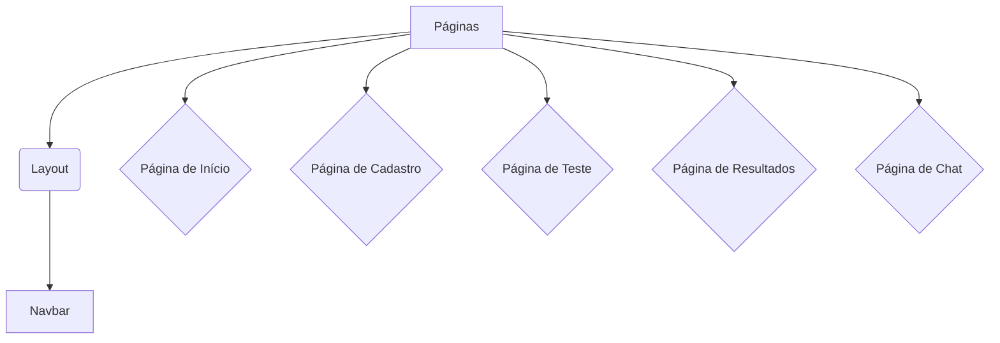

# Perfil MTBI - Teste de Personalidade e Chat com IA


## Tabela de Conteúdos

- [Sobre o Projeto](#sobre-o-projeto)
- [Arquitetura](#arquitetura)
- [Componentes do Frontend](#componentes-do-frontend)
- [Começando](#começando)
  - [Pré-requisitos](#pré-requisitos)
  - [Instalação](#instalação)
  - [Executando a Aplicação](#executando-a-aplicação)
- [Tecnologias Utilizadas](#tecnologias-utilizadas)
- [Contribuição](#contribuição)
- [Licença](#licença)

## Sobre o Projeto

O Perfil MTBI é uma aplicação web que permite aos usuários realizar um teste de personalidade baseado no modelo Myers-Briggs Type Indicator (MBTI). Após a conclusão do teste, os usuários recebem seu tipo de personalidade e podem interagir com um chatbot de IA para obter mais informações e insights sobre seu perfil.

A aplicação é construída com uma arquitetura de microsserviços, com um backend em Python (FastAPI) e um frontend em Next.js (React) com Tailwind CSS.

## Arquitetura

A arquitetura da aplicação é dividida em três componentes principais: o frontend, o backend e o banco de dados.

```mermaid
graph TD
    A[Usuário] --> B{Frontend (Next.js)};
    B --> C{Backend (FastAPI)};
    C --> D[Banco de Dados (PostgreSQL)];
```

- **Frontend:** A interface do usuário é construída com Next.js e Tailwind CSS. É responsável por apresentar o teste, exibir os resultados e fornecer a interface de chat.
- **Backend:** O backend é construído com Python e FastAPI. É responsável por toda a lógica de negócios, incluindo o gerenciamento de usuários, o processamento do teste e a interação com a IA do chat.
- **Banco de Dados:** O banco de dados PostgreSQL é usado para armazenar informações sobre usuários, perguntas do teste, respostas e histórico de chat.

## Componentes do Frontend

O frontend é estruturado em vários componentes reutilizáveis para criar uma interface de usuário consistente e modular.



- **Navbar:** O componente de navegação principal, presente em todas as páginas, exceto na de chat.
- **Páginas:** Cada página da aplicação é um componente React que lida com uma funcionalidade específica (início, cadastro, teste, resultados, chat).

## Começando

Para executar o projeto localmente, siga estas etapas.

### Pré-requisitos

- Docker
- Docker Compose

### Instalação

1. Clone o repositório:
   ```sh
   git clone https://github.com/caiosaldanha/perfil-mtbi.git
   ```
2. Navegue até o diretório do projeto:
   ```sh
   cd perfil-mtbi
   ```

### Executando a Aplicação

1. Execute o seguinte comando para construir e iniciar os contêineres Docker:
   ```sh
   docker compose up --build
   ```
2. A aplicação estará disponível nos seguintes endereços:
   - Frontend: [http://localhost:3000](http://localhost:3000)
   - Backend: [http://localhost:8000/docs](http://localhost:8000/docs)

## Tecnologias Utilizadas

- **Frontend:**
  - [Next.js](https://nextjs.org/)
  - [React](https://reactjs.org/)
  - [Tailwind CSS](https://tailwindcss.com/)
  - [TypeScript](https://www.typescriptlang.org/)

- **Backend:**
  - [Python](https://www.python.org/)
  - [FastAPI](https://fastapi.tiangolo.com/)
  - [PostgreSQL](https://www.postgresql.org/)

- **DevOps:**
  - [Docker](https://www.docker.com/)
  - [Docker Compose](https://docs.docker.com/compose/)

## Contribuição

As contribuições são o que tornam a comunidade de código aberto um lugar incrível para aprender, inspirar e criar. Quaisquer contribuições que você fizer serão **muito apreciadas**.

1. Faça um Fork do Projeto
2. Crie sua Feature Branch (`git checkout -b feature/AmazingFeature`)
3. Faça o Commit de suas alterações (`git commit -m 'Add some AmazingFeature'`)
4. Faça o Push para a Branch (`git push origin feature/AmazingFeature`)
5. Abra um Pull Request

## Licença

Distribuído sob a licença MIT. Veja `LICENSE` para mais informações.
